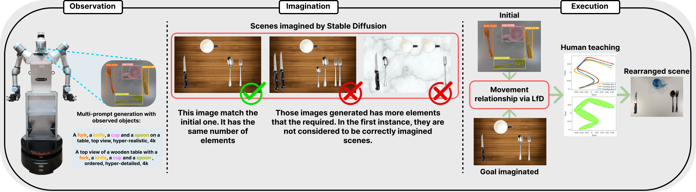
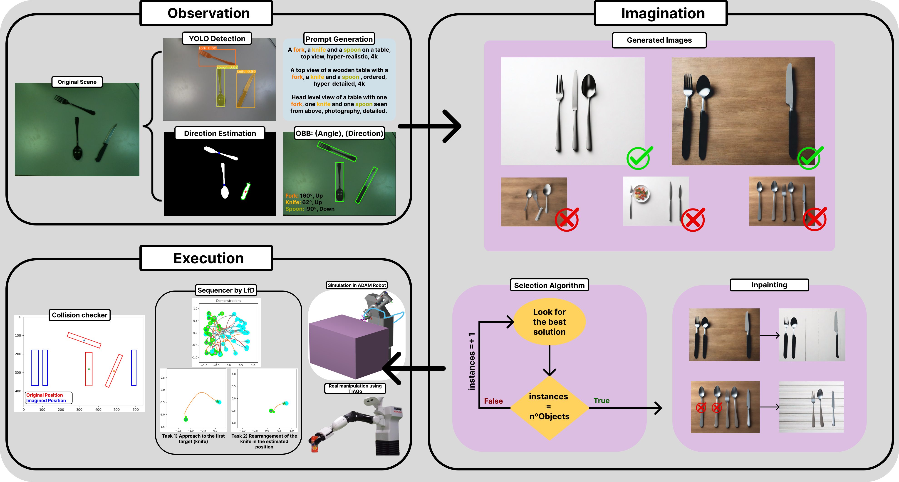

# **Everyday Objects Rearrangement in a Human-Like Manner via Robotic Imagination and Learning from Demonstration**
<p align="center">
  
</p>

The rearrangement of objects is an essential task in daily human life. Subconsciously, humans break down such tasks into three components: perception, reasoning, and execution, which are automatically resolved. This process represents a significant challenge for robots, as it must apply complex logic to treat all the information and successfully execute the task. In this research, we propose a solution to perform this task in a human-like manner. For that purpose, we developed a modular algorithm that provides the capability to observe and understand the scene, imaginate the best solution and execute it, following human-like reasoning. This is done combining a zero-shot deep learning model for perception, a zero-shot large diffusion model to provide a human-like final scene and a Learning from Demonstration algorithm for execution. To test the performance, we have made several experiments to check the correct resolution of the rearrangement task. To this end, we have checked the efficiency of the final scene generated, the correct performance of the path using human demonstrations and finally experiments with two different robots in a simulated and real environment. The results obtained prove the adaptability of our algorithm to different environments, objects and robots.

The model presented is divided in 3 diferent modules:
- *Observation Module* : detects the elements of the envionment using Yolov8.
- *Imagination Module* : generate a final state image taking into account the elements detected using Stable Diffusion.
- *Execution Module* : applies a propietary Learning from Demostration algorithm that only takes into account relevant frames based on TPGMM and Kullback-Leiberg divergence.

# Installation
To be used on your device, follow the installation steps below.

**Requierements:**
- Python 3.10.0 or higher


## Install miniconda (highly-recommended)
It is highly recommended to install all the dependencies on a new virtual environment. For more information check the conda documentation for [installation](https://conda.io/projects/conda/en/latest/user-guide/install/index.html) and [environment management](https://conda.io/projects/conda/en/latest/user-guide/tasks/manage-environments.html). For creating the environment use the following commands on the terminal.

```bash
conda create -n relocateEnv python=3.10.0
conda activate relocateEnv
```

### Install repository
Clone the repository in your system.
```bash
git clone https://github.com/AdrianPrados/klTPGMM.git
```

For each of the modules it is necessary to install different requierements:

### *Observation Module*
Follow the instructions in [Yolov8](https://github.com/ultralytics/ultralytics).

> **Note**: That modules requires the use of a Realsense D435 (or any other Realsense model)

### *Imagination Module*
Follow the instructions in [StableDiffusion](https://github.com/Stability-AI/generative-models)

### *Execution Module*
For that module it is neccesary to install the `executionReq.txt`

``` bash
cd Task_Parameterized_Gaussian_Mixture_Model
pip install -r executionReq.txt
```

# Usage
<p align="center">
  
</p>

#### *Observation*:
 This process starts with the acquisition of an top-view image $\mathcal{I}$ by the RGB-D camera (perpendicularly to the environment) where the robot will detect the elements placed on the table capturing the initial state $\mathcal{S}_{o}$. After this, the method will obtain in first instance the classes of the detected objects using YOLO v8. Additionally, a process of obtaining relevant geometric information (such as angle, direction and position in the image) that defines each of the objects of the classes separately will be performed. For this purpose, a mask generation process is applied and additionally, a handle detection process. This is necessary because the robot will act as a human manipulating the objects by these handles if they exist. Once we have this information, we generate a series of prompts $\mathcal{P}$ that establish the quantities of objects we are going to work with and will allow us to generate the images to establish the final positions. This information will be sent to the next module for the process to continue running.

#### *Imagination*:
 The information extracted from the image is received by the imagination module. This information is passed through the $\mathcal{P}$ prompts to the Stable Diffusion model which, through the information used for its training and without modifying the data, will generate a realistic image which has similar characteristics to how humans organise the elements of our environment. After this, the algorithm automatically searches for the image that most closely resembles the $\mathcal{I}$. In order to do this, it will first search for images that have the same number of objects as the initial state. If it does not obtain any image that is exactly the same, it will look for the most similar image possible (with as few variations of external elements as possible) and then it will carry out a filtering process by means of an inpainting process that will eliminate these extra elements. The image generated and filtered by Stable Diffusion will establish the final positions and orientations of the final $\mathcal{S}_{f}$ state. This information will be sent (along with the initial state data $\mathcal{S}_{o}$) to the trajectory execution platform.

#### *Execution*:
To perform a correct  rearrangement process, the objects in the $\mathcal{S}_{o}$ state must end up as the objects in the $\mathcal{S}_{f}$ state. The transition between the two states is not direct, as the rearrangement tasks are set up in a series of sub-tasks that allow the whole scene to be shaped correctly. To make this process in the most humane way, a module has been created that, by means of Learning from Demonstration, is able to perform each of the established sub-tasks. For this purpose, a proprietary algorithm based on TP-GMM has been created, to which a relevant frame selector has been added to optimise and improve the result for each of the actions and tasks to be performed. Prior to this process it is important to establish the optimal order of resolution, which is considered to be the order in which the objects between state transitions do not collide. For this purpose, a sorting and manipulation order selection logic has been implemented. Once this Execution process is finished, the task is considered as successfully completed by obtaining an organisation in the real environment equal to that obtained by the Imagination module, starting from the state obtained in the Observation module.
### **Algorithm execution**
To launch the algorithm, the Realsense camera must be connected. First, the element detection part in the environment will be launched, which will allow obtaining the objects that will generate the prompts. These prompts will trigger the generation of the Imaginative part. This section can be run directly or use a previously generated model with a large number of generated images. After waiting for enough time, the algorithm will choose one of the correct options, check for collisions, and provide the solution path results through the Learning from Demonstrations algorithm. By default, all results are plotted to allow the user to visualize the corresponding results of each section. This can be removed by hiding the `plt.show()` from the section that is not desired to be displayed.

To execute all the code run:

``` bash
python Controlller.py
```


# Citation
If you use this code, please quote our works :blush:

At the moment, pending of acceptance in a conference. :seedling: